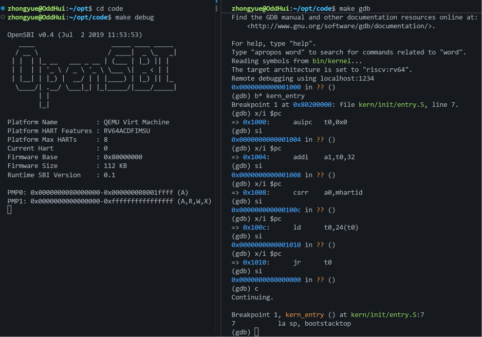

# 操作系统实验报告

## 实验基本信息

| 项目         | 内容                                           |
| ------------ | ---------------------------------------------- |
| **实验名称** | Lab 1: 比麻雀更小的麻雀（最小可执行内核）      |
| **小组成员** | 2411858-王钟岳、2412934-王海沛、2412143-林家熠 |
| **完成日期** | 2026-10-08                                     |

### 小组分工

| 成员           | 负责的练习/模块 |
| -------------- | --------------- |
| 2411858-王钟岳 | 练习2及报告     |
| 2412934-王海沛 | 练习1及报告     |
| 2412143-林家熠 | 练习1及报告     |

---

## 一、实验目的

<!-- 说明本次实验的主要目标和预期成果 -->

本实验的主要目的是：

1. 了解 Qemu 模拟器的启动流程
2. 储备一些程序内存布局和编译流程相关知识
3. 学会使用 GDB 进行调试

---

## 二、实验环境

你们使用的 AI 工具

| 成员           | AI 编程工具          | 底层模型    | 备注 |
| -------------- | -------------------- | ----------- | ---- |
| 2411858-王钟岳 | Codex（VS Code插件） | GPT-6 Astra |      |
| 2412934-王海沛 |                      |             |      |
| 2412143-林家熠 |                      |             |      |

**说明：**

- **AI 编程工具**：指具体使用的终端工具、编辑器插件、桌面应用或浏览器界面
- **底层模型**：指该工具使用的大语言模型及版本

---

## 三、实验整体逻辑分析

### 2.1 本章节的逻辑主线

本章围绕最小可执行内核和启动流程展开，重点讲解了操作系统初始化的启动流程、内核的内存分布和入口点设置、通过 OpenSBI 封装输入输出函数以及如何使用 Makefile 编译、如何使用 GDB 调试。

### 2.2 项目执行流

1. 加电复位，CPU从0x1000执行复位程序：完成最基本的环境准备并将控制权交给OpenSB，加载bootloader

2. 跳转至0x80000000执行bootloader：初始化处理器的运行环境，将编译生成的内核镜像文件加载到物理内存的0x80200000地址处

3. 执行位于0x80200000处的 entry.S：分配好内核栈，然后跳转到 kern_init

4. 执行kern_init：初始化内核环境，向用户提供可视化反馈。

---

## 四、实验内容与实现

### 练习1：理解内核启动中的程序入口操作

**负责人：** 2412934-王海沛、2412143-林家熠

[按照练习的具体要求进行解答]

---

### 练习2：使用GDB验证启动流程

**负责人：** 2411858-王钟岳

**调试过程：**
在 code 文件夹下分别使用两个终端，一个执行 make debug 启动 QEMU，一个执行 make gdb 启动 GDB 进行调试。在 kern_entry 处设置断点，单步调试并查看加电后最初执行的几条指令的地址与内容，跳转后执行至断点处。

**问题回答：**
硬件加电后最初执行的几条指令位于 0x1000 到 0x1010 。完成了最基本的环境准备，并跳转至 0x80000000。具体来说实现了：

1. 准备设备树（DTB）地址，存入寄存器 a1（addi a1, t0, 32）

2. 准备 CPU 核心编号（Hart ID），存入寄存器 a0（csrr a0, mhartid）

3. 跳转至 0x80000000，移交控制权（jr t0）

---

## 五、测试与验证

**测试截图：**

---

## 六、实验总结与收获

### 对操作系统的理解

1. 列出你们认为本实验中重要的知识点，以及与对应的 OS 原理中的知识点，并简要说明二者的含义、关系和差异
2. 列出你们认为 OS 原理中很重要、但在本实验中没有对应上的知识点

### AI 协作开发的经验

[写出你们在与 AI 协作过程中实际收获的经验或者感悟]

---
